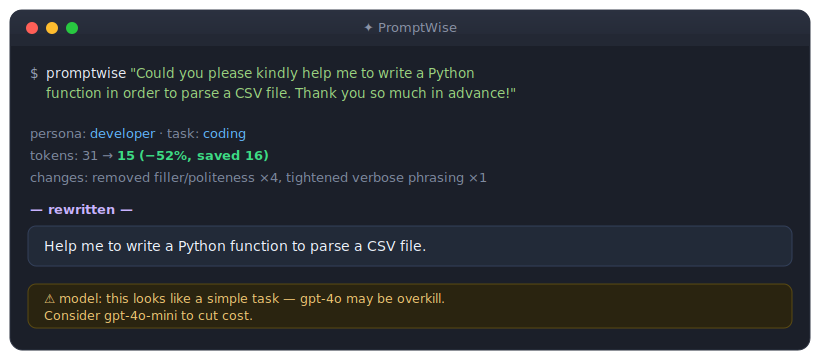
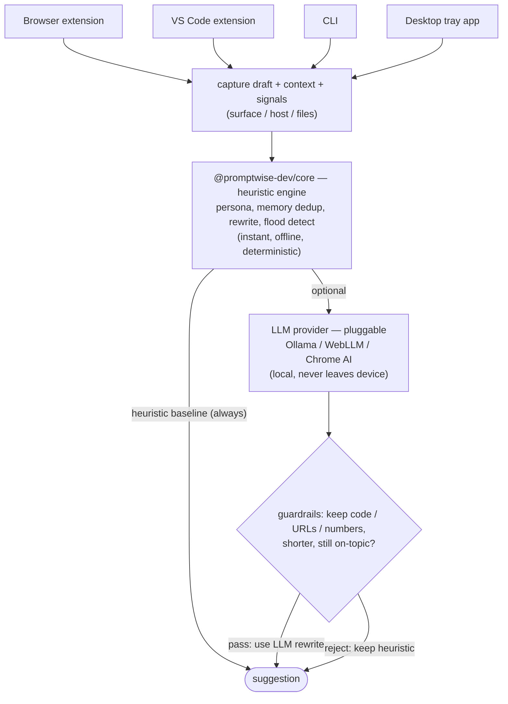

# PromptWise

**Smarter Prompts. Better Results.**

[](https://github.com/Nirupam014/promptwise/actions/workflows/ci.yml)
[](LICENSE)
[](https://www.npmjs.com/package/@promptwise-dev/core)
[](https://nodejs.org)
[](CONTRIBUTING.md)

A universal prompt-optimization layer that plugs in everywhere you talk to an
LLM — the browser, your IDE, the CLI, and desktop AI tools. It reads the prompt
you're about to send, rewrites it using conversation context and your global
memory to deliver the same result for fewer tokens, and nudges you to reset the
conversation when context floods.

This repository is a working, **zero-dependency** implementation. The rewrite
logic is fully local and heuristic — nothing is sent anywhere, and there is no
build step. Plain JavaScript that runs in Node and the browser as-is.



<sub>Illustrative — a recorded GIF of the live extension/CLI can replace this.</sub>

---

## What's inside

```
packages/
  core/                @promptwise-dev/core — shared engine (rewrite, flood,
                       memory, persona, summarizer, LLM providers). Zero deps.
  cli/                 @promptwise-dev/cli — command-line adapter (+ --llm)
  browser-extension/   MV3 extension for ChatGPT / Claude / Gemini (Chrome+Firefox)
  vscode-extension/    IDE adapter (VS Code / JetBrains-style)
  mcp-server/          MCP connector — exposes PromptWise as tools inside
                       Claude desktop (optimize / summarize / memory)
  desktop/             (experimental) Electron tray app — global-hotkey
                       optimizer for the native desktop AI apps
scripts/
  sync-core.js         copies the engine into the extensions' vendor/core
  build-firefox.js     produces the Firefox-compatible extension build
examples/              sample conversation for the flood demo
```

The repo is an npm workspaces monorepo. `@promptwise-dev/core` and `@promptwise-dev/cli`
are publishable; the extensions are installed from their folders. The browser
and VS Code extensions ship a **vendored copy** of the engine under
`vendor/core` so they're standalone — `npm run sync-core` regenerates those
copies and CI (`npm run check-core`) fails if they drift.

Every surface is a thin adapter over the same `core` engine, so behavior is
identical no matter where you type.

## Architecture

One brain, many bodies. Each surface captures the draft prompt and visible
context, hands it to the shared engine, and renders the result — all logic lives
in `core`.



**Data flow for one optimize call:**

1. The adapter sends `{ prompt, context, signals }` to the engine.
2. **Persona** is inferred from the surface/host/file-type signals.
3. **Memory** facts overlapping the prompt are pulled in.
4. The **heuristic rewrite** runs (filler/hedge removal, verbose simplification,
   dedup against context + memory) — instant, and the guaranteed baseline.
5. *If an LLM provider is attached*, it produces a candidate rewrite, which must
   pass **guardrails** (code/URLs/numbers preserved, shorter, still on-topic).
   Whichever of heuristic vs. verified-LLM is shorter wins; on any failure or
   error, the heuristic result stands.
6. The adapter shows the suggestion; nothing is sent until the user accepts.

**Key properties:**

- **Zero-dependency core.** Plain JS, no build step; the same files run in Node
  (`require`) and the browser (each module attaches to `window.PromptWiseCore`).
- **Local & private.** Heuristics make no network calls; the optional LLM runs
  locally (Ollama on `localhost`, or WebLLM in the tab via WebGPU).
- **Heuristic is always the floor.** The LLM can only improve on a result that's
  already safe — it never degrades or changes intent.
- **Standalone surfaces.** Browser/VS Code ship a vendored copy of the engine
  under `vendor/core`; `scripts/sync-core.js` keeps it in lockstep and CI fails
  on drift.

A per-module breakdown of the engine lives in
[`packages/core`](packages/core#readme).

## The engine (`packages/core`)

The headline capabilities (each its own module; see the module map above for the
full list including summarizer, brevity, and model-fit):

- **Rewrite** (`rewrite.js`) — removes politeness/filler and hedges, simplifies
  verbose phrasing, and drops sentences the model already has (from the visible
  thread or your memory). Protects code blocks, URLs, and numbers verbatim, and
  never returns something longer than the original.
- **Flood detection** (`flood.js`) — scores a conversation on size, length,
  repetition, and drift, then recommends `summarize` or `reset` and extracts the
  durable facts worth carrying into memory so nothing is lost.
- **Memory** (`memory.js`) — a user-controlled store of durable facts the engine
  dedupes prompts against, so you stop re-sending the same context.
- **Persona** (`persona.js`) — infers who you are *per surface and per session*
  (developer / power-chatter / analyst-writer) from the host app, file types,
  and prompt content, and tailors the rewrite accordingly.

`engine.js` ties them together behind one object the adapters call:

```js
const { PromptWise } = require("./packages/core/src/index.js");
const pw = new PromptWise();
pw.memory.add("The project is a Next.js e-commerce app.");

const out = pw.optimize({
  prompt: "As you know the project is a Next.js e-commerce app, so could you please just add a checkout button to it.",
  signals: { surface: "ide", hostApp: "vscode" },
});

out.rewrite.percentSaved;  // -> token saving %
out.suggestion.rewritten;  // -> the tighter prompt
out.persona.persona;       // -> "developer"
```

## Install

```bash
# the engine, as a library
npm install @promptwise-dev/core

# the CLI, globally
npm install -g @promptwise-dev/cli
promptwise "Could you please kindly summarize this in order to save time. Thanks!"
```

```js
const { PromptWise } = require("@promptwise-dev/core");
const pw = new PromptWise();
const out = pw.optimize({ prompt: "Could you please just help me to fix this." });
console.log(out.suggestion.rewritten);
```

The browser and VS Code extensions are installed from their package folders — see
[their READMEs](#install-the-adapters).

## Develop from source

```bash
git clone https://github.com/Nirupam014/promptwise.git
cd promptwise

# run the test suite (62 tests, no install needed)
npm test            # or: node --test packages/core/test/*.test.js

# optimize a prompt from the CLI
node packages/cli/promptwise.js "Could you please kindly summarize this in order to save time. Thanks!"

# analyze a thread for context flooding
node packages/cli/promptwise.js flood examples/conversation.json

# manage global memory
node packages/cli/promptwise.js memory add "We use TypeScript and pnpm."
node packages/cli/promptwise.js memory list
```

## Install the adapters

- **Browser extension** — `chrome://extensions` → enable Developer mode → *Load
  unpacked* → select `packages/browser-extension`. Open ChatGPT, Claude, or
  Gemini and start typing; a suggestion chip appears above the composer.
- **VS Code extension** — copy `packages/vscode-extension` into your extensions
  folder (or open it and press F5 to launch an Extension Development Host).
  Select a prompt → `PromptWise: Optimize Selected Prompt` (⌘⌥P / Ctrl+Alt+P);
  `Deep Optimize` (⌘⌥⇧P, streaming), `Summarize Selection`, `Curate Memory`.
- **CLI** — symlink or alias `packages/cli/promptwise.js` as `promptwise`, then
  run **`promptwise init`**: it detects your shell + coding agents (Claude Code,
  Aider, Auggie, Cursor, Goose) + Ollama and writes wrappers so optimization is
  one command (`ccp "…"` for Claude Code, `pwo "…"` for any agent), plus an
  optional Claude Code hook. Also: `--llm`, `summarize`, `memory curate`,
  `--brief`, `--raw`, and an interactive `session` token tracker.
- **MCP connector (Claude desktop)** — add `packages/mcp-server/server.js` to
  your Claude desktop config to expose PromptWise as tools (optimize, summarize,
  memory). See [packages/mcp-server](packages/mcp-server).

> **Experimental:** a **desktop companion** (`packages/desktop`, Electron) adds a
> global-hotkey clipboard optimizer for the *native* desktop AI apps. It works
> but is unpolished and unsigned — see [packages/desktop](packages/desktop).

See each package's README for details.

## How the savings work (input vs output tokens)

A chat turn spends tokens in three places, and PromptWise has a lever for each:

| Cost | Lever | What it does |
|------|-------|--------------|
| **New prompt** (input) | rewrite + dedup | removes filler, simplifies phrasing, drops sentences already in the thread/memory |
| **Re-pasted blocks** (input) | reference replacement | replaces a re-pasted code block/quote already in the thread with a pointer ("the code above") |
| **The whole re-sent history** (input) | summarize-and-reset | the dominant cost in long chats — distill the thread into memory and start a fresh chat seeded with a summary |
| **The model's answer** (output) | `outputBudget` | appends a brevity directive ("no preamble; ≤N words") to cap answer length |

> **Important:** in the browser, the chat *site* sends the full conversation
> history to its own backend on every turn — an extension can't rewrite that
> request. So the big input-token win mid-thread is **resetting** (the flood
> banner's *Start fresh chat*), not per-prompt trimming. When PromptWise builds
> the API call itself (CLI/IDE usage), it can trim the whole payload directly.

```js
const pw = new PromptWise({
  outputBudget: { words: 120, noPreamble: true }, // cap the answer (output tokens)
  contextDropThreshold: 0.7,                       // trim partial overlaps too (input tokens)
});
const out = pw.optimize({ prompt, context });      // context now drives reference + dedup
out.suggestion.rewritten;       // compressed prompt + brevity directive
out.suggestion.outputDirective; // the appended directive (or null)
```

In the browser popup these are the **Token saving** toggles; in the flood banner,
**Start fresh chat** performs the reset.

## Model-fit check (don't pay for overkill)

PromptWise can flag when you're using an **expensive model for a cheap task** and
nudge you to a cheaper one — across surfaces, from the same core. It pairs a
model **cost-tier registry** (frontier / mid / cheap, with cheaper siblings) with
a **task-complexity** heuristic; a frontier model on a simple task gets a nudge.

```js
pw.assessModel("gpt-4o", "what is the capital of France?");
// → { overkill: true, suggestion: "gpt-4o-mini", message: "…may be overkill…" }
```

- **Browser** — reads the selected model from the page; the chip shows "⚠ model"
  with the suggestion when it's overkill.
- **CLI** — `promptwise "<task>" --for-model gpt-4o` prints the nudge.
- **MCP** — a `check_model_fit` tool Claude can call.
- The registry is approximate and user-overridable (model lineups change); it's a
  hint, not a verdict.

## Optional local LLM

By default everything is heuristic, instant, and offline. You can optionally add
a **local LLM** for higher-quality rewrites, real conversation summaries, and
smarter memory curation — still fully on-device. Two backends, one interface:

- **Ollama** (`localhost:11434`) — works in the IDE and browser; run any model.
- **WebLLM** (in-browser WebGPU) — no install, nothing leaves the tab; browser only.

The heuristic result is always the **verified fallback**: any LLM rewrite that
drops code, a URL, a number, or drifts off-intent is rejected automatically.

```js
const { PromptWise, createOllamaProvider } = require("@promptwise-dev/core");
const pw = new PromptWise({ provider: createOllamaProvider({ model: "llama3.2:3b" }) });
const out = await pw.optimizeWithLLM({ prompt: "Could you please just help me fix this." });
out.mode; // "llm" or "heuristic" (fallback)
```

In the browser, the chip gains a **✦ Deep** button and the flood banner can
summarize-and-save; in VS Code, **Deep Optimize** (`⌘⌥⇧P`) and **Curate Memory**.
Full setup (Ollama install, `OLLAMA_ORIGINS`, WebGPU notes) is in
[docs/LOCAL-LLM.md](docs/LOCAL-LLM.md).

## Design notes

- **Suggest, never silently rewrite.** Every surface shows the saving and the
  rewrite, and requires an explicit Apply.
- **Local and private.** The heuristic engine makes no network calls; prompts
  never leave the device. The architecture leaves room for an optional LLM
  rewrite provider behind the same interface later.
- **One brain, many bodies.** Adapters are intentionally thin; all logic lives
  in `core` so a new surface ships without re-implementing anything.

## Tests

```bash
npm test
```

62 unit tests cover token estimation, rewrite safety (code/URL/number
preservation, never-longer guarantee), reference replacement, context dedup,
persona detection, memory dedup, flood recommendations, the extractive
summarizer, output-brevity directives, model-fit checks, the LLM provider
guardrails (Ollama stream/list/pull/diagnose, Chrome AI, WebLLM), and the
end-to-end engine.

## Contributing

Issues and PRs are welcome. Please read [CONTRIBUTING.md](CONTRIBUTING.md) and
our [Code of Conduct](CODE_OF_CONDUCT.md) first. Security reports go through
[SECURITY.md](SECURITY.md), not public issues.

## License

[MIT](LICENSE) © Nirupam Chakrabarti
